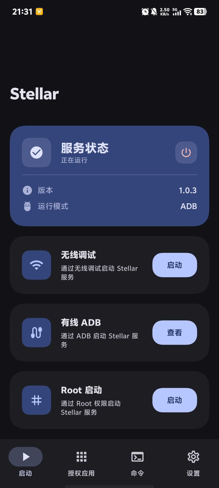
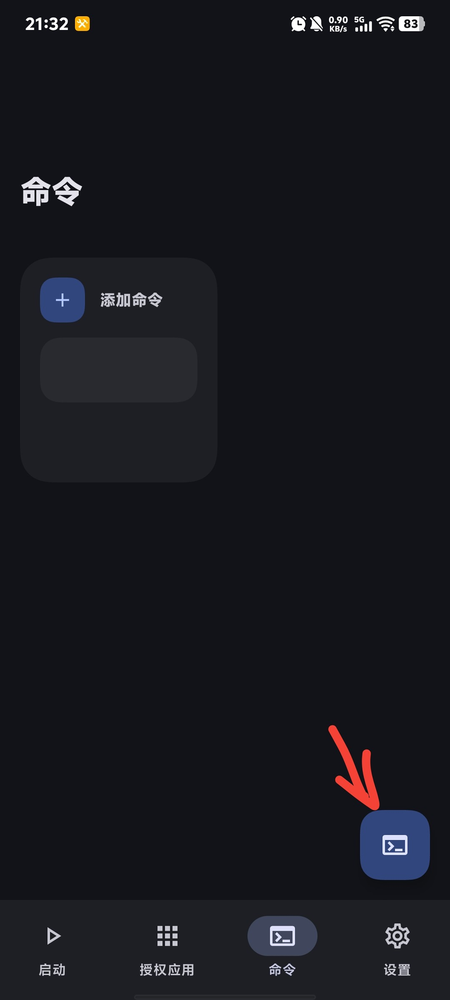
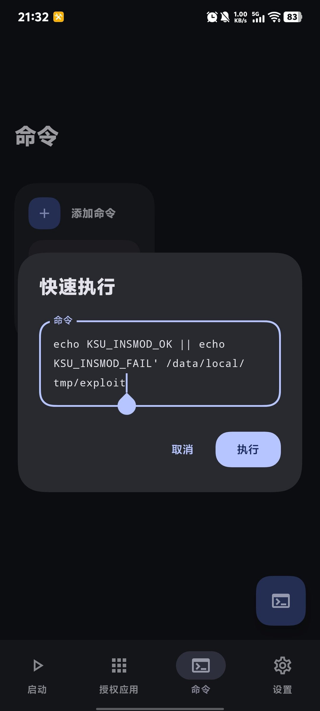
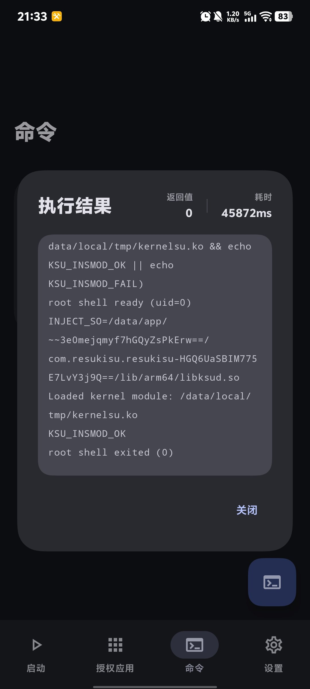

> **进行下面步骤前请先确认安卓版本是否为 15**

<!--more-->

## 第一步

下载并安装 **resukisu** 和 **stellar**。

## 第二步

在底部链接中下载自己设备的 **exploit** 和 **kernelsu.ko**，并放入 `/data/local/tmp` 目录（需要 MT 管理器）。

## 第三步

下载并根据指示激活 **Stellar**。



## 第四步

点击底部命令，并点击右下角按钮输入命令。



## 第五步

依次输入下面代码并执行：

```bash
chmod 755 /data/local/tmp/exploit
```

```bash
bash
ROOT_CMD='SO=$(find /data/app -type f -name libksud.so 2>/dev/null | head -1); [ -z $SO ] && { echo NO_LIBKSUD; exit 1; }; echo INJECT_SO=$SO; $SO insmod /data/local/tmp/kernelsu.ko && echo KSU_INSMOD_OK || echo KSU_INSMOD_FAIL' /data/local/tmp/exploit
```



## 第六步

查看输出，看是否成功。

输出中出现 `KSU_INSMOD_OK` 即为成功。



## 第七步

冷启动 resukisu。
